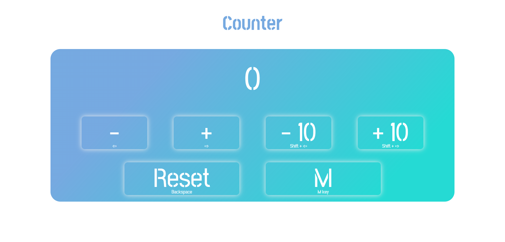
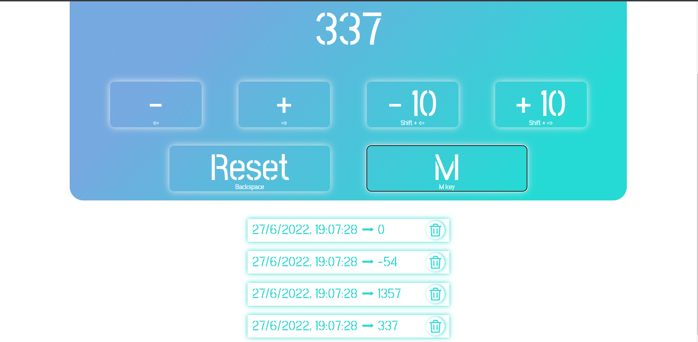
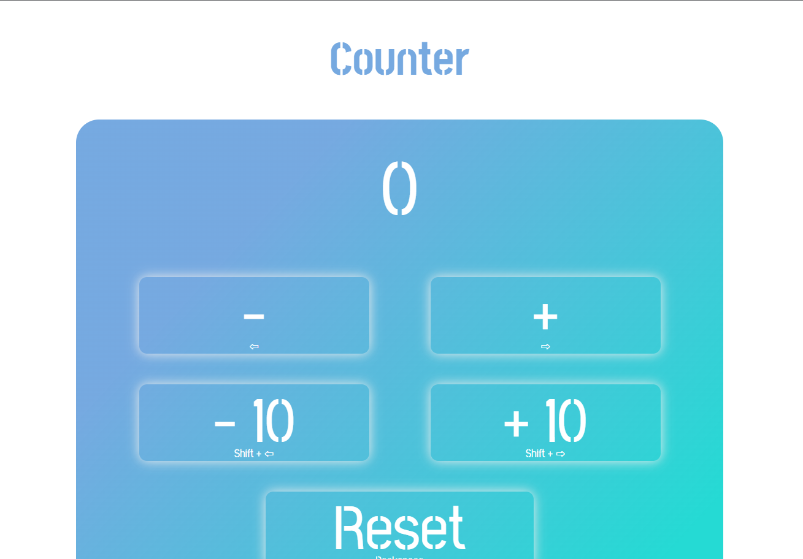
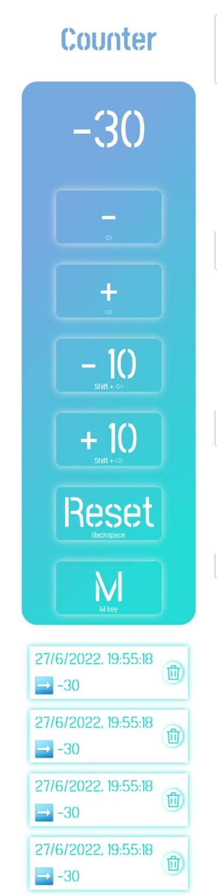

# Counter
## Javascript Basic Project for start2impact

### Table of contents

- [About the project](#about-the-project)
  - [Built with](#built-with)
- [Usage](#usage)
- [Responsive](#responsive)
- [Contact](#contact)

### About the project

This project represents a counter.
You can use it to count everything you want, from how many donuts you ate yesterday to the score you give to all your ex partners.

#### Built with

This project is built with:
- HTML
- CSS
- Javascript

### Usage

The counter is very intuitive to use. 
You can increment the value with the `plus` button and you can use the `less` button to decrement it. If you need to count a very high figure, you can add a value equal to ten using the `plus ten` button or subtract the same value with the `less ten` button.
When you want start again just use `Reset` button.

You can storage all the value you need using the `M` button

By doing so, it will give you the date and time the value was saved. And when you don't need it anymore, you just click on the `trush` button.

You can also use keyboard shortcuts:

- `plus` = `Right Arrow`
- `less` = `Left Arrow`
- `plus ten` = `Shift` + `Right Arrow`
- `less ten` = `Shift` + `Left Arrow`
- `Reset` = `Backspace`
- `M` = `M key`

### Responsive

You can use this counter on several devices.

#### Tablet device

#### Mobile device

## Contact

Giumentaro Serena https://www.linkedin.com/in/serenagiumentaro/

Project Link https://giumentarocounter.netlify.app/

